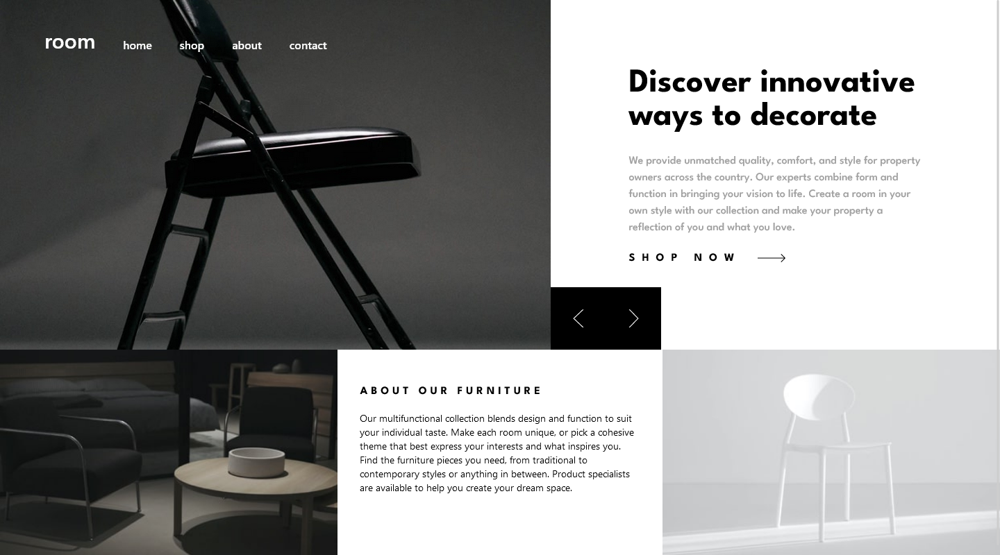

# Frontend Mentor - Room homepage solution

This is a solution to the [Room homepage challenge on Frontend Mentor](https://www.frontendmentor.io/challenges/room-homepage-BtdBY_ENq). Frontend Mentor challenges help you improve your coding skills by building realistic projects.

## Table of contents

- [Overview](#overview)
  - [The challenge](#the-challenge)
  - [Screenshot](#screenshot)
  - [Links](#links)
- [My process](#my-process)
  - [Built with](#built-with)
  - [What I learned](#what-i-learned)
- [Author](#author)

**Note: Delete this note and update the table of contents based on what sections you keep.**

## Overview

### The challenge

Users should be able to:

- View the optimal layout for the site depending on their device's screen size
- See hover states for all interactive elements on the page
- Navigate the slider using either their mouse/trackpad or keyboard

### Screenshot

### Links

- Solution URL: [Solution](https://cbuntrakulsuk.github.io/room-homepage/)
- Live Site URL: [Room Homepage](https://cbuntrakulsuk.github.io/room-homepage/)

## My process

### Built with

- Semantic HTML5 markup
- TailwindCss
- Flexbox
- Mobile-first workflow
- Javascript

## Author

- Website - [Chad Buntrakulsuk](https://github.com/cbuntrakulsuk)
- Frontend Mentor - [@cbuntrakulsuk](https://www.frontendmentor.io/profile/cbuntrakulsuk)
